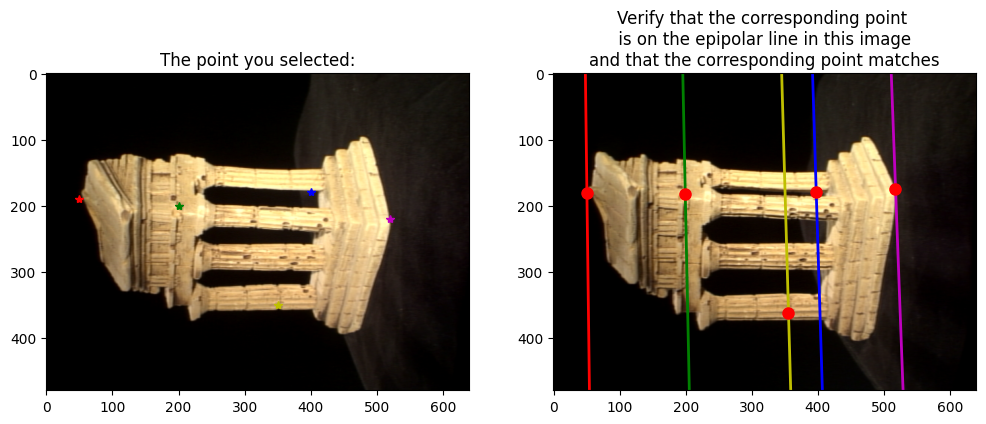
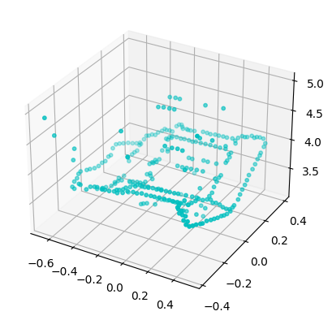
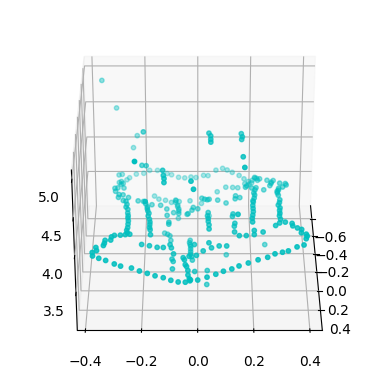
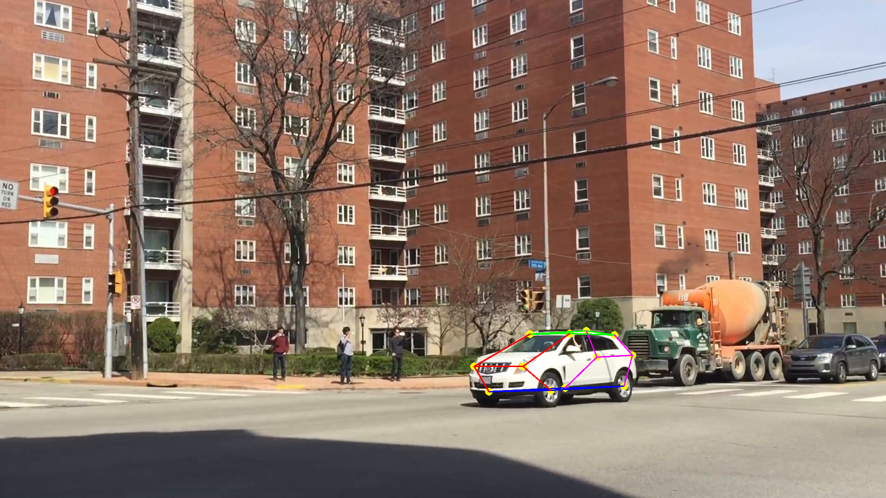
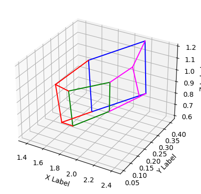
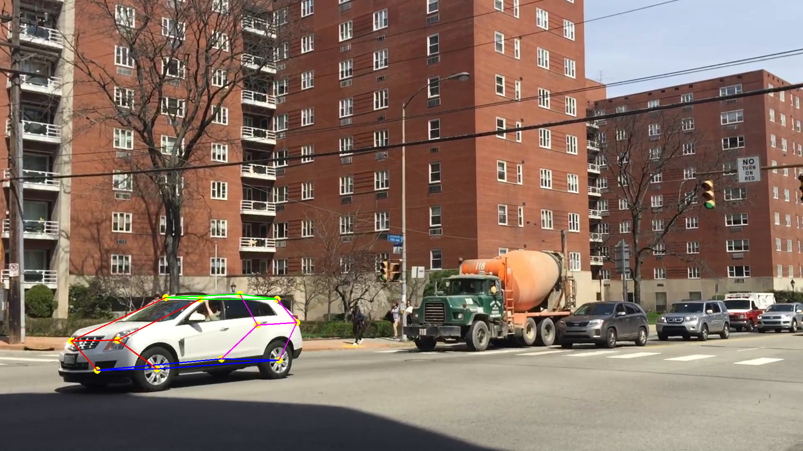
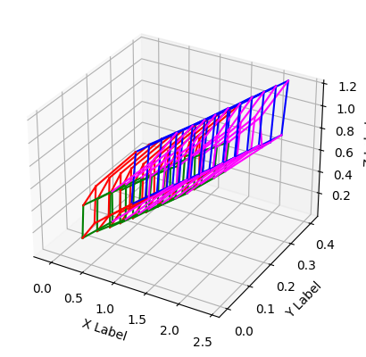

# 3D-Reconstruction using Stereo Images

## Project Overview
This project implements a 3D reconstruction pipeline using stereo vision techniques. It covers fundamental concepts in computer vision, including epipolar geometry, camera calibration, and triangulation.
## Implementation

The epipolar correspondences are generated as follows: 



Eventually this can be reconstructed as: 

 

For a robot that tracks multiple views, the reconstruction can start as this:

 

Eventually after combined iterations:


 


## Key Features
- **Fundamental Matrix Estimation**: Implements the 8-point algorithm to compute the fundamental matrix from corresponding points in two images.
- **Essential Matrix Calculation**: Derives the essential matrix from the fundamental matrix using camera intrinsics.
- **Camera Pose Estimation**: Recovers the relative pose of the second camera with respect to the first.
- **3D Point Triangulation**: Reconstructs 3D points from 2D correspondences using linear triangulation.
- **Epipolar Geometry Visualization**: Provides tools to visualize epipolar lines and verify the computed fundamental matrix.

## Technical Highlights

### Fundamental Matrix Estimation
The 8-point algorithm is implemented with the following optimizations:
- Normalization of input points for numerical stability
- Singular Value Decomposition (SVD) for solving the linear system
- Rank-2 constraint enforcement
- Refinement using non-linear optimization

### Essential Matrix Computation
The essential matrix is derived using the formula:
```python
E = K2.T @ F @ K1

```
Where K1 and K2 are the intrinsic camera matrices.

### Camera Pose Recovery
Multiple candidate poses are generated from the essential matrix decomposition.
The correct pose is selected based on the cheirality condition (points must be in front of both cameras).
3D Reconstruction is achieved through linear triangulation which is used to reconstruct 3D points. The method solves a homogeneous system of equations derived from the projection equations of both cameras.

